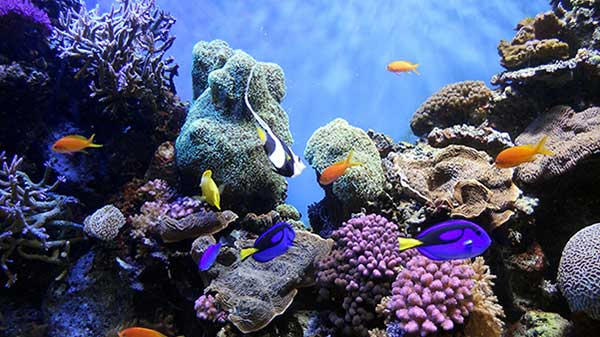
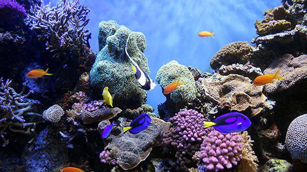

<!DOCTYPE html>
<html lang="en">
  <head>
    <meta charset="UTF-8" />
    <title>Web Images</title>
  </head>

  <body>

  <h1>Web Images</h1>

  
Original Image: 1.9MB

   
  
Low quality (7%). File size:26.65k 

  
  
Medium quality (30%). File size: 46.29k 

  
  
High quality (75%). File size: 129.9k 

  
  
Very quality (80%). File size: 150.1k

  
  
Maximum quality (100%). File size: 290.6k 

  </body>
</html>
