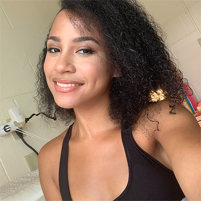

<!DOCTYPR html>

   <meta charset="utf.8">

<title>resume</title>

</head>

<body>
	<h1>JOANNA NAOMI MINOTT</h1>

<article>
<h2> About me</h2>

<header>

<h5>Contact Info</h5>
<h5> Education</h5>
<h5> Skills</h5>
<h5>  Work Experience and Campus Involvment</h5>

</header>

<h2>Summary</h2>
<section>
<article>

 Extremely motivated individual with a drive to learn and develop. Seeking an ideal internship that utilizes problem solving and collaboration to promote character and increase exposure as a Software Developer.

<h5>B.A Computer Science </h5>  									   
<h5>Minor in electronic media and interactive media</h5>	
</article>
</section>
<section>
<h2>Contact Information</h2>
<table>
<tr>
<th> TYPE</th>
<th> CREDENTIALS</th>
</tr>
<tr>
<td>E-mail</td>
<td><a href="https://outlook.office.com/mail/inbox"> jnm128@miami.edu</a></td> 
</tr>
<tr>
<td>phone number</td>
<td>631-796-3682</td>
</tr>
</table>
</section>

<section>	
<h2>Education</h2>
<table>
<tr>
<th>NAME</th>
<th>YEAR GRADUATED</th>
</tr>
<tr>
<td><a href= "https://bhs.bufsd.org/home">Brentwood High School</a></td>
<td>june 2018</td>
</tr>
<tr>
<td> <a href="https://welcome.miami.edu/"> University of Miami</a></td>
<td>Prospected: May 2022</td>
</tr>
</table>
</section>
<section>
<h2>Skills</h2>
<table>
<tr>
	<th>PROGRAM</th>
	<th> Level of proficency</th>
</tr>
<tr>
<td>Java</td>
<td> Advanced</td>
</tr>
<tr>
<td> Adobe Photoshop</td>
<td> Intermediate</td>
</tr>
	
<tr>
	<td>Adobe Illustrator</td>
	<td> Advanced</td>
</tr>
<tr>
<td> Onbase Unity Client </td>
<td>Intermediate</td>
</tr>
<tr>
<td> Microsoft Word</td>
<td> Advanced</td>
</tr>
<tr>
<td> Microsoft Excel</td>
<td> Advanced</td>
</tr>
</table>
</section>

<main>						                                                                           						
<h2>Work/Involvement Experience</h2> 
<section>
<article>	
<h3>University of Miami Informational Technologies Department</h3>                          <h4>January 2019- present</h4>
<h4>Student Assistant</h4> 
	

Efficiently completed assigned tasks using the software OnBase Unity Client using the document retrieval software to transfer and manage information documented on paper to a digital database. Also, I use Microsoft excel to correct mistakes or make changes towards the company's employee database.

</article>
</section>
</main>
<section>
<main>
<article>
<h3> Phi Sigma Pi National Gender Inclusive Fraternity</h3>   <h4>January 2019- Present</h4>
<h4> Executive Board Secretary</h4>
	

successfully work alongside the president to remind and provide them with information about the brothers under the confidentiality code of honor, Sub Rosa.

<ul>
	<li>Created excel spread worksheet and kept track of attendance of brothers.</li>
	<li>record and send minutes to fraternity via E-mail.</li>
</ul>
</article>
</section>
<section>
<h3>Impact Leadership Retreat</h3>						                           
<h4>November 2019</h4>
<h4>Participant</h4>

 Participated in teambuilding exercises to asset strengths and weaknesses as a leader.
<ul>
	<li>develop collegial relationships through skills and concepts driven by empathy and transparency.</li>
	</ul>

</section>
<h3> Social Media</h3>
<nav>
<a href="https://jovisuals.blogspot.com/">Blogspot</a>
	<a href= "https://www.facebook.com/">Facebook</a>
	<a href= "https://www.instagram.com/jo.naomii/?hl=en">Instagram</a>
</nav>
	
	

</main>

</body>
</html>
